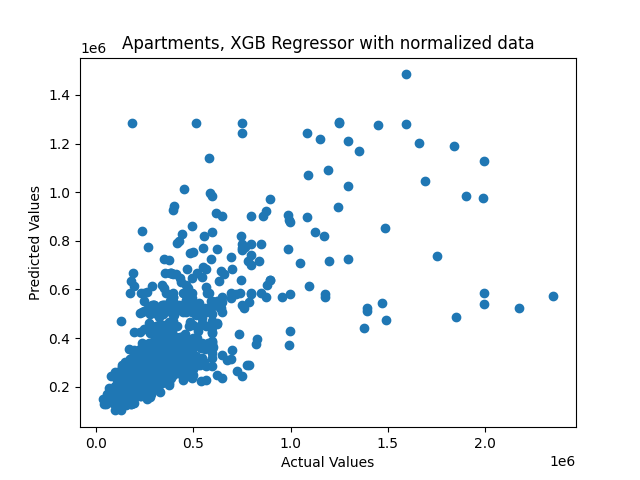
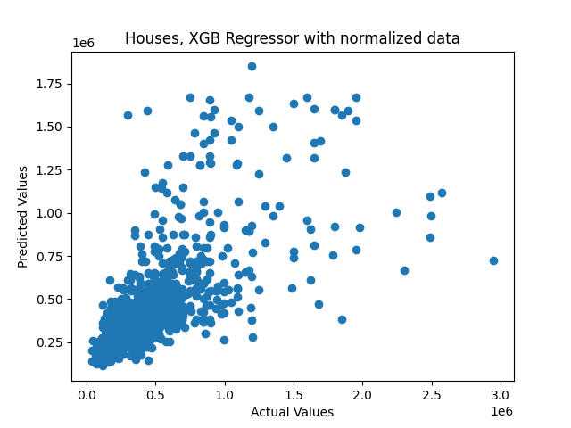

# Immo Eliza Analysis

A personal project @ [BeCode.org](https://becode.org/) as part of the **AI Bootcamp** in Gent.
## Description

This is the second, the third and the fourth stages of the project, which aim to create a machine learning model to predict prices in Belgium's real estate sales.

The purpose of the second stage is to analyze the data gathered during the first stage and visualize the current situation in the real estate market. To achieve this, the following objectives were set:

Data Cleaning: All data gathered during the first stage were thoroughly cleaned. This process involved removing duplicates, blank spaces, errors, and empty values.

Data Analysis: Approximately 19,000 properties that are currently for sale throughout Belgium were analyzed.

Data Visualization: The gathered data were visualized using the Python data visualization library 'Seaborn'. A presentation of the results was created and can be found in the data folder.

The purpose of the third stage of the project is to create a machine learning model to predict prices in Belgium's real estate sales. To achieve this goal, all analyzed data was selected for further processing. The data was cleaned, formatted, and divided into two parts: Apartments and Houses. More than 5000 objects were analyzed for each category.

For each of these parts, separate pipelines were created since tendencies for price formatting differ between apartments and houses. Different machine learning models were built for each category, including Linear Regression (with and without data normalization), Decision Tree, XGBoost Regression, and SGD Regression.

The results and the process of creating these models are displayed in '/model_building/Model_Building.ipynb'. The accuracy score varied for each model, leading to the selection of the "XGBoost Regression" model for the final implementation of the third stage of the project, as it provided the best result.

The relationships between test target data and predicted target data are visualized on the plots.





The purpose of the fourth stage of the project is to create an API capable of predicting real estate prices in Belgium. This API will allow web developers to build a website around it. FastAPI was chosen as the framework for implementing this stage due to its capabilities and speed. The data required for prediction should be provided in the following format:
{
    "data": {
        "property_type": "str",
        "floor": "NonNegativeInt",
        "bedrooms_number": "NonNegativeInt",
        "habitable_surface": "NonNegativeFloat",
        "bathroom_number": "NonNegativeInt",
        "condition": "NonNegativeInt"
    }
}

To obtain the prediction, a POST request should be made to the API.

## Installation

 Clone [ImmoElizaAnalysis](https://github.com/MykolaSenko/ImmoEliza-Prediction.git) repository
2. Change directory to the root of the repository
3. Install required libraries by running `pip install -r requirements.txt`

## Usage

# Environment Activation:
Before you begin, activate the project environment by running the following command in your terminal.
# Second Stage of the Project:
Run the 'Data_Analysis.py' script in your code editor. This is likely for data analysis in the project's second stage.
# Third Stage of the Project:
Run the 'main.py' script from the parent directory in your terminal. This indicates the third stage of the project, which might involve data processing, modeling, or other tasks.
# Visualization and Data Locations:
All visualization plots and maps are saved into the 'output' folder, while all data is saved into the 'data' folder. Make sure to check these directories for the results and generated data.
# Machine Learning Model Analysis:
To observe the process and results of applying different machine learning models, run the 'Model_Building.ipynb' notebook from the '/model_building' directory. This is likely for model evaluation and selection.
# Fourth Part - Deployment:
For the fourth part of the project, navigate to the "/deployment" directory in your terminal and run the following command:
```uvicorn app:app --reload```
This will start the server for the deployed application. You can access the application in your web browser using the host address shown in the terminal, typically "127.0.0.1:8000". To see the API documentation, add "/docs" to the address, like "127.0.0.1:8000/docs". From there, you can use the form in your browser to send a POST request with input features data to predict the target variable.

Remember to follow the steps in order, and make sure you have all the necessary dependencies and files before running the scripts or commands. Good luck with your project!

## Timeline

This second stage of the project lasted 5 days July 5-11, 2023. 
The third stage of the project lasted 4 days July 17-20, 2023.
The fourth stage of the project lasted 3 days July 26-28, 2023.
## Author

The stage was made by Junior AI & Data Scientist Mykola Senko [LinkedIn](https://www.linkedin.com/in/mykola-senko-683510a4/) | [GitHub](https://github.com/MykolaSenko)

## Instruction

The stage was made under the supervision of [Vanessa Rivera Quiñones](https://www.linkedin.com/in/vriveraq/) and [Samuel Borms](https://www.linkedin.com/in/sam-borms/?originalSubdomain=be)

## License

This project is under [GNU General Public License v3.0](./LICENSE) which allows to make modification to the code and use it for commercial purposes.

Gent, July 28, 2023.

[def]: image.png